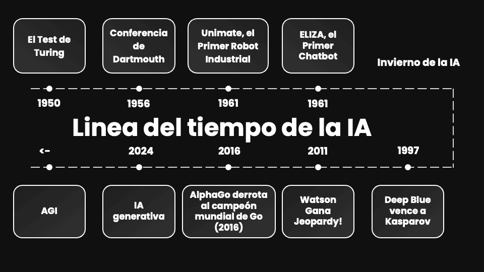

## Introducción

> "La IA es la ciencia de hacer que las máquinas hagan cosas que requerirían inteligencia si las hiciera un humano." 
> — *Marvin Minsky*

La Inteligencia Artificial (IA) ha dejado de ser un concepto de ciencia ficción para convertirse en el motor de la cuarta revolución industrial. En esta sesión, exploraremos su origen y la transición hacia modelos basados en datos.

## Evolución Histórica: Línea del Tiempo

::: {.column-page}
{#fig-historia fig-align="center"}
:::

::: {.callout-note collapse="true"}
### Detalle de los hitos históricos (Click para expandir)

| Año | Hito | Descripción |
|------|------|-------------|
| **1950** | Test de Turing | Alan Turing define la base de la imitación de la inteligencia humana. |
| **1956** | Dartmouth | Nacimiento oficial del término "Inteligencia Artificial". |
| **1997** | Deep Blue | Victoria de la máquina sobre el campeón mundial de ajedrez (G. Kasparov). |
| **2016** | AlphaGo | Superación de la intuición humana en el juego de Go. |
| **2024** | IA Generativa | Capacidad de simular la creatividad humana (Text-to-All). |
:::

---

## La IA como Herramienta de Predicción {#sec-prediccion}

Esta es la clave del salto tecnológico actual. La IA moderna no "comprende" el mundo, sino que **predice** el siguiente valor más probable basándose en patrones matemáticos.

### La Analogía Neuronal

Para entender la predicción, debemos observar cómo se estructuran estos modelos inspirándose en la biología:

::: {layout-ncol=2}
{#fig-bio}

{#fig-art}
:::

::: {.callout-tip}
### Concepto Clave: El Peso ($w$)
En una red neuronal, la "predicción" se ajusta modificando los **pesos**. Si un dato es muy importante para el resultado (ej. los metros cuadrados para el precio de una casa), su peso será mayor.
:::

---

## Programación Tradicional vs. Modelos de Aprendizaje

Para un perfil universitario, es vital distinguir el **software basado en reglas** del **software basado en datos**.

::: {.panel-tabset}

### 1. Modelo de Reglas (Tradicional)
El programador define cada escenario posible mediante sentencias `if-else`.

```{python}
#| label: tasador-manual
#| echo: true
def tasador_manual(metros, zona):
    precio_base = metros * 1500
    if zona == "Centro":
        return precio_base + 50000
    elif zona == "Playa":
        return precio_base + 80000
    else:
        return precio_base

print(f"Precio (Reglas): {tasador_manual(80, 'Centro')}€")