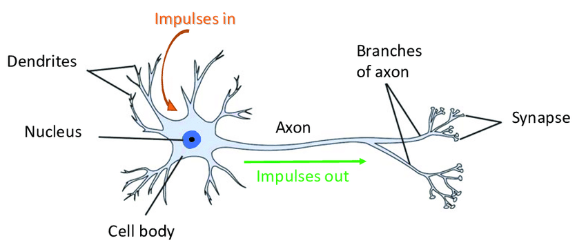
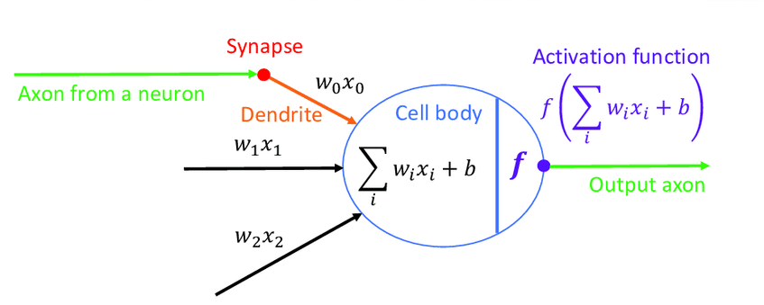

## 1. ¿Qué es la Inteligencia Artificial? 
La IA es un campo de la informática que se enfoca en crear sistemas capaces de realizar tareas que normalmente requieren inteligencia humana, como el aprendizaje, la toma de decisiones y la resolución de problemas.

## 2. La IA como Herramienta de Predicción 
La IA se basa en algoritmos que analizan grandes cantidades de datos para identificar patrones y hacer predicciones. Esto es fundamental para aplicaciones como la predicción del clima, recomendaciones de productos y detección de fraudes.


::: {layout-ncol=2}



:::

* **Ejemplo:** Predicción del clima, recomendaciones de productos, detección de fraudes.

::: {.note}
💡 **Nota:** La IA aprende de ejemplos, no de reglas fijas.
:::

.....
## 3. Algoritmos Tradicionales vs. Modelos de Aprendizaje ⚙️
### 💻 Recurso Interactivo: El Salto Tecnológico

Observad la diferencia entre dar una orden rígida y dejar que el sistema aprenda.

#### 1. Programación Tradicional (Reglas fijas)
En este modelo, si el programador olvida una regla (ej. "vistas al mar"), el precio nunca cambiará aunque la casa sea preciosa.

###  Recurso Interactivo: El Salto Tecnológico
Aquí compararemos un sistema basado en reglas (If-Else) frente a uno predictivo.

🛠️ Recurso Práctico: De las Reglas a la Predicción
Para experimentar con estos conceptos, utilizaremos Google Colab, una herramienta que te permite ejecutar código en la nube sin instalar nada en tu ordenador.
```{python}
# Ejemplo de programación tradicional
def tasador_manual(metros, zona):
    precio_base = metros * 1500
    
    # Aquí definimos las "reglas"
    if zona == "Centro":
        return precio_base + 50000
    elif zona == "Playa":
        return precio_base + 80000
    else:
        return precio_base

# Prueba cambiando los valores abajo:
resultado = tasador_manual(80, "Centro")
print(f"Precio calculado por reglas: {resultado}€")

```
En este ejemplo, el modelo de aprendizaje puede ajustar su predicción basándose en los datos, mientras que la programación tradicional no puede adaptarse a nuevas situaciones sin modificar el código.

2. El modelo de "IA" (Aprendizaje Automático) 🧠
Ahora, en lugar de escribir reglas, vamos a darle ejemplos a la IA para que ella "deduzca" cuánto vale cada característica. Verás que no es magia, sino un ajuste matemático de pesos.
```{python}
import numpy as np
from sklearn.linear_model import LinearRegression
# Datos de ejemplo: metros cuadrados, zona (0=Interior, 1=Playa), precio
X = np.array([[80, 0], [80, 1], [100, 0], [100, 1], [120, 0], [120, 1]])
y = np.array([120000, 200000, 150000, 250000, 180000, 300000])      
# Entrenamos el modelo
modelo = LinearRegression() 
modelo.fit(X, y)
# Prueba con nuevos datos
nueva_casa = np.array([[90, 1]])  # 90 metros en zona de playa
prediccion = modelo.predict(nueva_casa)
print(f"Precio predicho por IA: {prediccion[0]:.2f}€")
```

## 4. IA de Película vs. IA de Bolsillo 

* **IA General (Ficción):** El mito de Terminator.
* **IA Estrecha (Realidad):** Netflix, Google Maps y ChatGPT.

## 5. Cierre: Tu primer Prompt efectivo ✍️

Para que la IA pase de darnos respuestas genéricas a soluciones brillantes, usaremos la fórmula **R-T-C**:

1.  **R**ol: Dile quién debe ser (ej: "Actúa como un experto en...")
2.  **T**area: Qué quieres que haga exactamente (ej: "Escribe un resumen de...")
3.  **C**ontexto: Detalles que limitan o guían (ej: "Para un público principiante y en menos de 100 palabras").

### 🚀 ¡Pruébalo ahora!
Copia y completa este ejemplo en ChatGPT:
> *"Actúa como un **[Rol: Profesor de secundaria]**. Explica **[Tarea: qué es una neurona artificial]** usando una analogía sobre **[Contexto: el funcionamiento de una fábrica]**."*